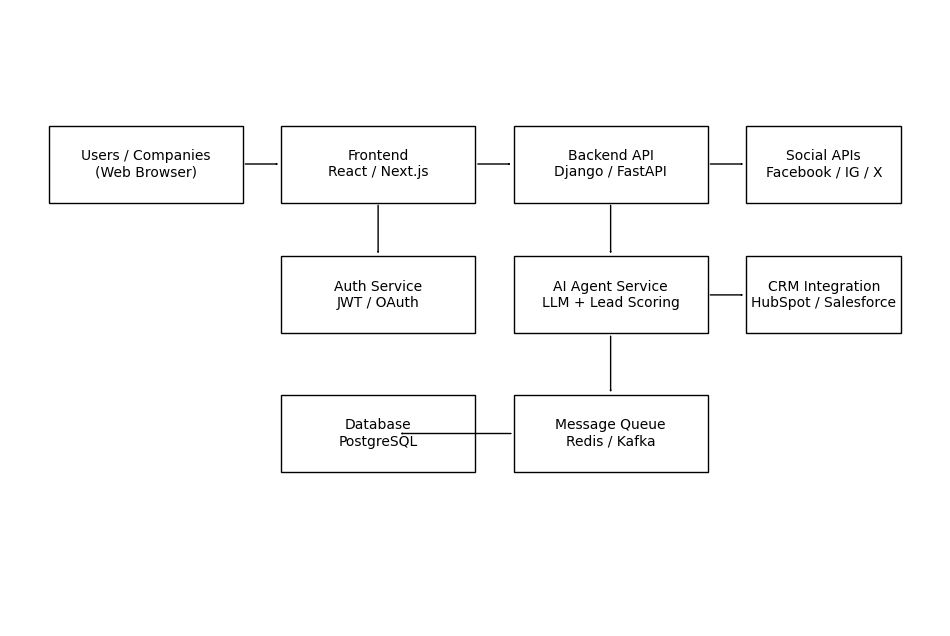
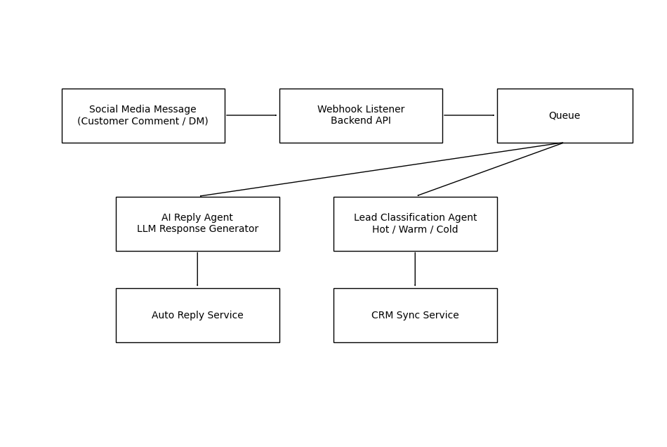

# AI Agent SaaS Platform -- System Design

## Overview

This project presents the **system design for an AI-powered SaaS
platform** that allows companies to connect their social media accounts,
automatically respond to customer messages, classify leads, and
synchronize information with CRM systems.

The platform leverages **AI agents, automation pipelines, and scalable
web architecture**.

## Architecture Diagram

## Data Flow Diagram

------------------------------------------------------------------------

# System Components

## 1. Frontend Layer

Technologies: - React / Next.js - Tailwind UI - WebSockets for real-time
updates

Responsibilities: - User dashboard - Social account connection - Lead
monitoring - AI response configuration - CRM synchronization settings

------------------------------------------------------------------------

## 2. Backend API Layer

Technologies: - Django / FastAPI - REST API - Webhook listeners

Responsibilities: - Social media webhook handling - Communication with
AI agents - Queue job dispatching - CRM integration - Data persistence

------------------------------------------------------------------------

# AI Agents

## 1. AI Reply Agent

Purpose: Generate automated responses to incoming social media messages.

Model Options: - Open-source LLM (Llama / Mistral) - API-based models
(OpenAI)

Tasks: - Understand intent - Generate context-aware replies - Maintain
conversation tone

------------------------------------------------------------------------

## 2. Lead Classification Agent

Purpose: Automatically categorize leads.

Classes: - Hot Lead - Warm Lead - Cold Lead

Approach: - NLP classification model - Message sentiment + intent
analysis - Customer engagement history

------------------------------------------------------------------------

## 3. CRM Sync Agent

Purpose: Synchronize tagged leads and conversation data with CRM.

Supported systems: - Salesforce - HubSpot - Zoho CRM

------------------------------------------------------------------------

# Frontend → Backend → AI Data Flow

Step 1: Customer sends message on social media.

Step 2: Social platform triggers webhook.

Step 3: Backend receives message.

Step 4: Message pushed to queue.

Step 5: AI agents process the message.

Step 6: Reply agent generates response.

Step 7: Lead classification agent tags the lead.

Step 8: CRM sync agent stores lead data.

Step 9: Auto-reply is posted to social media.

Step 10: Dashboard updates for company users.

------------------------------------------------------------------------

# Authentication & Authorization

Methods: - OAuth2 for social media connections - JWT for user sessions -
Role-based access control

Roles: - Admin - Marketing Manager - Support Agent

Security layers: - API Gateway validation - Token expiration - Rate
limiting

------------------------------------------------------------------------

# Data Security & Privacy

Key mechanisms:

Encryption: - HTTPS/TLS - Encrypted database fields

Storage: - Secure credential storage - Token vault for social APIs

Compliance: - GDPR - SOC2 design practices

Access control: - Role-based access - Audit logs

------------------------------------------------------------------------

# Cost Optimization Strategies

1.  Queue-based asynchronous processing
2.  Batch CRM synchronization
3.  Model caching
4.  Hybrid LLM strategy
5.  Auto-scaling infrastructure
6.  Message summarization before LLM calls

------------------------------------------------------------------------

# Failure Scenarios & Recovery

## Social API Failure

Solution: - Retry queue - Exponential backoff

## AI Model Failure

Solution: - Fallback rule-based responses

## Queue Failure

Solution: - Dead letter queue

## CRM Integration Failure

Solution: - Sync retry service

## High Traffic Load

Solution: - Auto-scaling workers - Load balancing

------------------------------------------------------------------------

# Suggested Tech Stack

Frontend: - React / Next.js

Backend: - FastAPI / Django

AI Services: - Python microservices - HuggingFace Transformers

Infrastructure: - Docker - Kubernetes - Redis / Kafka - PostgreSQL

Cloud: - AWS / GCP

------------------------------------------------------------------------

# Conclusion

The proposed architecture enables companies to **automatically engage
with customers on social media using AI**, classify potential leads, and
synchronize data with CRM systems.

The system is designed to be: - scalable - secure - cost-efficient -
modular

------------------------------------------------------------------------
